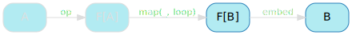
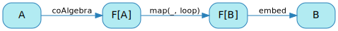

[English version (origin)](https://nrinaudo.github.io/recschemes/ana.html)

[Назад](./unfold.md) | [Оглавление](./README.md) | [Дальше](./hylo.md)

# Обобщённая развёртка

Мы реализовали обобщенную функцию генеративной рекурсии для списков, `unfold`. Наша задача теперь превратить её в правильную схему рекурсии: генеративную рекурсию, которая работает для *любого* рекурсивного типа данных.

## Обобщенный `unfold`

Мы воспользуемся тем же подходом, что и раньше: начнём с `unfold` специфичного для `List` и будем рефакторить до тех пор, пока он не перестанет быть специфичным для `List`.

Вот наша реализация `unfold`:

```scala
def unfold[A](
  predicate: A => Boolean,
  update   : A => (Int, A)
): A => List = {

  def loop(state: A): List =
    if(predicate(state)) {
      val (head, nextState) = update(state)
      Cons(head, loop(nextState))
    }
    else Nil

  loop
}
```

Однако мы будем использовать кратчайший путь: теперь, когда мы знаем о паттерне функтор и его способности представлять промежуточные шаги в рекурсивном алгоритме, мы постараемся использовать его как можно скорее.

## Упрощаем `predicate` и `update`

Первое место, где мы можем увидеть форму `ListF`, паттерна функтор для списка, находится в` predicate` и `update`:


Если прищуриться, на самом деле это одна функция от состояния до опциональной головы и следующего состояния:


Назовем эту единственную функцию `op`.

`op` вычисляет наш предикат (_пустая ли строка?_) и, если он истинен, помещает результат `update` в `Some`. Если нет, он вернет `None`.

```scala
val op: String => ListF[String] =
  state => {
    if(state.nonEmpty) Some((state.head.toInt, state.tail))
    else               None
  }
```

Это позволяет нам упростить `loop` до сопоставления с образцом:

```scala
def unfold[A](
  op: A => ListF[A]
): A => List = {

  def loop(state: A): List =
    op(state) match {
      case Some((head, nextState)) => Cons(head, loop(nextState))
      case None                    => Nil
    }

  loop
}
```

`unfold` теперь внезапно выглядит как более знакомая диаграмма:


## Абстрагирование структуры

Пока мы пытаемся форсировать `ListF` в `unfold`, давайте взглянем на другую сторону диаграммы:


Это в действительности функция, которая при наличии необязательных головы и хвоста (`ListF`) превращает их в список.

Эта функция широко известна как `embed` и имеет простую реализацию:

```scala
val embed: ListF[List] => List = {
  case Some((head, tail)) => Cons(head, tail)
  case None               => Nil
}
```

Если у нас есть голова и хвост, мы превратим их в список. В противном случае у нас пустой список.

Мы можем обновить функцию `unfold` так, чтобы она принимала `embed` в качестве параметра, что позволяет нам избавиться от явных ссылок на `Cons` и `Nil`:

```scala
def unfold[A](
  op   : A => ListF[A],
  embed: ListF[List] => List
): A => List = {

  def loop(state: A): List =
    op(state) match {
      case Some((head, state)) => embed(Some((head, loop(state))))
      case None                => embed(None)
    }

  loop
}
```

Как и раньше с `cata`, обратите внимание, что `embed` вызывается в результате обеих ветвей сопоставления с образцом, что позволяет нам переместить его наружу:

```scala
def unfold[A](
  op   : A => ListF[A],
  embed: ListF[List] => List
): A => List = {

  def loop(state: A): List =
    embed(op(state) match {
      case Some((head, state)) => Some((head, loop(state)))
      case None                => None
    })

  loop
}
```

В результате получается немного более сложная, но опять же подозрительно знакомая диаграмма:


## Используем функтор

Теперь, когда мы втиснули паттерн функтор в `unfold`, всё как бы становится похоже. Взгляните на центральную часть нашей диаграммы.


Мы превращаем `ListF[A]` в `ListF[List]` применяя функцию `A => List` к `A`. Это снова функторы!

Мы можем заменить сопоставление с образцом на `map`, потому что это одно и то же:

```scala
def unfold[A](
  op   : A => ListF[A],
  embed: ListF[List] => List
): A => List = {

  def loop(state: A): List =
    embed(map(op(state), loop))

  loop
}
```

Это очень хорошо упрощает нашу диаграмму:


## Абстрагируемся от `ListF`

Нам еще предстоит решить несколько вопросов. Во-первых, `ListF`:


Это очень специфично для `List`, и мы хотим от этого избавиться. К счастью, единственное, что нам действительно нужно знать о `ListF`, - это то, что мы можем вызывать для него `map` - что у него есть экземпляр функтора. Мы можем заменить его параметром типа с теми же ограничениями:

```scala
def unfold[F[_]: Functor, A](
  op   : A => F[A],
  embed: F[List] => List
): A => List = {

  def loop(state: A): List =
    embed(map(op(state), loop))

  loop
}
```

И это полностью избавляет от `ListF`.


## Абстрагируемся от `List`

Наконец, наш `unfold` по-прежнему жестко запрограммирован на `List` в качестве выходного типа.


На самом деле это не обязательно, поскольку мы никогда не используем тот факт, что мы работаем со списком - просто тип, с которым `op` и` embed` знают, как работать.

Это позволяет нам превратить его в параметр типа:

```scala
def unfold[F[_]: Functor, A, B](
  op   : A => F[A],
  embed: F[B] => B
): A => B = {

  def loop(state: A): B =
    embed(map(op(state), loop))

  loop
}
```

И, наконец, у нас не осталось ничего специфичного для `List` в нашем `unfold`.



## Именование

Теперь, когда у нас есть полностью обобщенный `unfold`, пора дать ему собственное имя. Это называется _анаморфизмом_, сокращенно _ана_:

```scala
def ana[F[_]: Functor, A, B](
  op   : A => F[A],
  embed: F[B] => B
): A => B = {

  def loop(state: A): B =
    embed(map(op(state), loop))

  loop
}
```

Эти имена следуют той же логике, что и _катаморфизм_: вся его цель - убедиться, что вы знаете, что тот, кто использует его, умнее вас.

И, конечно, `op` не подходящее название для `A => F[A]`.

Если вы помните, с `cata` у нас была функция `F[A] => A`, которую мы назвали алгеброй. Её тип очень похож на тип `op` - фактически, это то же самое, что и "перевернутая стрелка". Переворачивание стрелок - очень популярное занятие среди людей, разбирающихся в теории категорий, и всякий раз, когда им это удается, они говорят, что объект с перевернутой стрелкой является двойственным оригиналу и является _ко-_ оригинальной вещью.

Поэтому неудивительно, что `op` известен как коалгебра.

```scala
def ana[F[_]: Functor, A, B](
  coAlgebra: A => F[A],
  embed    : F[B] => B
): A => B = {

  def loop(state: A): B =
    embed(map(coAlgebra(state), loop))

  loop
}
```

`ana` работает точно так же, как и раньше для `charCodes`:

```scala
mkString(ana(op, embed).apply("cata"))
```

И теперь, когда мы все правильно назвали, мы получаем полную диаграмму для `ana`:



## `range` как `ana`

Мы знаем, что `charCodes` можно реализовать как конкретную версию `ana` - это то, чем мы занимались до этого.

Вот как можно реализовать `range` в виде анаморфизма:

```scala
val rangeCoAlgebra: Int => ListF[Int] = i => {
  if(i > 0) Some((i, i - 1))
  else      None
}

val range: Int => List =
  ana(rangeCoAlgebra, embed)
```

И вы получите тот же результат, что и при первоначальной реализации:

```scala
mkString(range(3))
// res39: String = 3 :: 2 :: 1 :: nil
```

## Ключевые выводы

Мы увидели, что анаморфизмы были обобщенными развёртками (`unfold`) для типов, которые могли быть встроены (`embed`) в паттерн функтор, и что их изобретение было в основном вопросом использования паттерна функтор в необобщенном `unfold`.

Что немного удивительно, так это то, насколько они похожи на катаморфизмы. Это интересная зацепка.

[Назад](./unfold.md) | [Оглавление](./README.md) | [Дальше](./hylo.md)

This work is licensed under a <a rel="license" href="https://creativecommons.org/licenses/by/4.0/">Creative Commons Attribution 4.0 International License</a>.