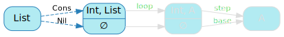
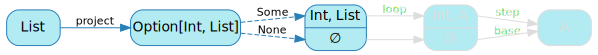
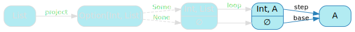
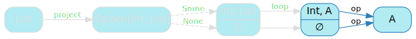
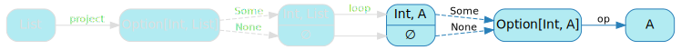
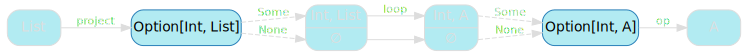
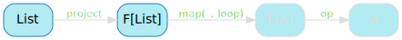
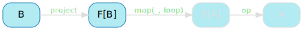
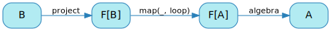

[English version (origin)](https://nrinaudo.github.io/recschemes/cata.html)

[Назад](./fold.md) | [Оглавление](./README.md) | [Дальше](./tree_height.md)

# Обобщённая свёртка

Мы обобщили структурную рекурсию, но только для List. Давайте теперь займемся задачей обобщения `fold` - как бы обобщения обобщенной структурной рекурсии.

Это текущая реализация `fold`:

```scala
def fold[A](
  base: A,
  step: (Int, A) => A
): List => A = {

  def loop(state: List): A =
    state match {
      case Cons(head, tail) => step(head, loop(tail))
      case Nil              => base
    }

  loop
}
```

Наша задача, таким образом, - попытаться удалить из этого кода все, что напрямую связано с `List`.

## Абстрагирование структуры

Давайте сначала посмотрим на ту часть, которая работает конкретно со структурой списка:



Берем `List` и следуя его структуре получаем `Cons` или `Nil`, но на это можно посмотреть иначе: мы получаем `head` и `tail`... или ничего. И в Scala для этого есть специальный тип подразумевающий возможность отсутствия данных: `Option`.

Использование `Option` вместо `List` не решит нашу задачу - опциональный `head` и `tail` все еще очень похож на `List`. Но это шаг в правильном направлении: мы двигаемся от `List` к более обобщенному типу.

Конечно, чтобы работать с опциональным `head` и `tail`, мы должны превратить List в Option. Это широко известно как проекция, что в нашем случае является прямым сопоставлением с образцом: `Cons` превращается в `Some`, а `Nil` в `None`.

```scala
val project: List => Option[(Int, List)] = {
  case Cons(head, tail) => Some((head, tail))
  case Nil              => None
}
```

Это позволяет нам передать в `fold` функцию проекции и удалить прямые ссылки на структуру списка:

```scala
def fold[A](
  base   : A,
  step   : (Int, A) => A,
  project: List => Option[(Int, List)]
): List => A = {

  def loop(state: List): A =
    project(state) match {
      case Some((head, tail)) => step(head, loop(tail))
      case None               => base
    }

  loop
}
```

Однако это немного усложняет наше графическое представление поведения `fold`:



Предупреждение: все станет немного хуже, прежде чем станет лучше. Эта диаграмма будет расти еще немного, но если вы потерпите меня, она *станет* намного лучше.

В итоге.


## Упрощаем base и step

Когда вы вводите новый тип, всегда полезно проверить, не появляется ли он где-нибудь еще. Если это так, возможно, вы на правильном пути к поиску общей структуры, с помощью которой, если повезет, вы сможете абстрагироваться.

И в нашем случае, опциональный `head` и `tail` действительно появляется снова, хотя и несколько менее очевидным образом:




`step` принимает параметры `head` и `tail`, а `base` не принимает параметров, поэтому мы может объединить их вместе и получить функцию ожидающую на вход опциональный `head` и `tail`.

Давайте напишем эту функцию. Назовем её `op`, потому что я умею давать вещам ужасные имена, и следую правилу здравого смысла _называй плохим именем, пока не узнаешь, что оно на самом деле делает_:


```scala
val op: Option[(Int, String)] => String = {
  case Some((head, tailResult)) => step(head, tailResult)
  case None                     => base
}
```

Если помните, мы все еще работаем с `mkString`: наш обобщенный `fold` вызывается с конкретными параметрами, которые превращают его в функцию получения строкового представления списка. Держа это в уме:
* `step` это объединение текстового представления `head` и `tail`, разделенных `" :: "`.
* `base` это просто `"nil"`.

```scala
val op: Option[(Int, String)] => String = {
  case Some((head, tailResult)) => head + " :: " + tailResult
  case None                     => "nil"
}
```

Это позволяет нам переписать `fold` используя `op` вместо `base` и `step`:

```scala
def fold[A](
  op     : Option[(Int, A)] => A,
  project: List => Option[(Int, List)]
): List => A = {

  def loop(state: List): A =
    project(state) match {
      case Some((head, tail)) => op(Some((head, loop(tail))))
      case None               => op(None)
    }

  loop
}
```

И, конечно же, все по-прежнему ведет себя точно так же, как и раньше:

```scala
fold(op, project)(ints)
// res12: String = 3 :: 2 :: 1 :: nil
```

Но получившаяся диаграмма немного разочаровывает:



Немного неприятно, что `op` появляется дважды.

Однако мы можем легко исправить это, осознав, что `op` появляется справа от всех ветвей сопоставления с образцом, что позволяет нам переместить его за пределы сопоставления:

```scala
def fold[A](
  op     : Option[(Int, A)] => A,
  project: List => Option[(Int, List)]
): List => A = {

  def loop(state: List): A =
    op(project(state) match {
      case Some((head, tail)) => Some((head, loop(tail)))
      case None               => None
    })

  loop
}
```

Это дает следующую диаграмму, которая немного загружена, но делает явным наличие наших необязательных `head` и` tail`:



## Промежуточное представление

Давайте немного подумаем об этих необязательных `head` и` tail`. Я говорил `tail` не заостряя внимания на важных деталях, и сейчас самое время посмотреть на них внимательнее.



С левой стороны у нас есть хвост списка. Но с правой стороны у нас есть `А`. Это больше не конец списка, так что же он представляет?

Это помогает думать о `fold` как о механизме поиска решения задачи, где сама задача является входным `List`.

Например, `mkString` находит решение _какое текстовое представление у этого списка?_. Он идет от `List`, задача *до* решения, к `String`, задача *после* решения (также известная как решение).

И если вы думаете об этом в таком свете, то опциональный `head` и `tail` это очень конкретное представление структурной рекурсии. Возьмите `Option[(Int, List)]`. Он содержит:
- наименьшую возможную задачу: `None`, пустой список
- бóльшую задачу `Some`, разложенную на меньшую задачу, `tail`, и дополнительную информацию, `head`

Но `Option[(Int, A)]` немного другой: в случае `Some`, `tail` больше не меньшая задача, а её решение - текстовое представление списка. И это очень удобно! Вас просят решить задачу, предоставив:
- наименьшую возможную задачу: `None`, пустой список
- бóльшую задачу, разложенную на *решение меньшей задачи* и дополнительную информацию, `head`

Этот опциональный `head` и `tail` является чрезвычайно интересным типом, поскольку он позволяет нам представлять промежуточные этапы нашей свёртки (`fold`). Настолько интересный, что мы дадим ему имя: `ListF`.

```scala
type ListF[A] = Option[(Int, A)]
```

У этого неприятного названия есть конкретная причина. Часть `List` очевидна: `ListF` имеет какое-то отношение к спискам, так что давайте оставим это там. Однако я пока не буду объяснять букву `F`, чтобы не испортить интуицию, которую я надеюсь развить.

Мы используем `ListF` для представления различных шагов нашей свёртки (`fold`).

Во-первых, декомпозируем задачу на основные компоненты структурной рекурсии, которую мы получаем через `project`:

```scala
val project: List => ListF[List] = {
  case Cons(head, tail) => Some((head, tail))
  case Nil              => None
}
```

`List`, параметр типа для `ListF`: тип задачи до ее решения.

Но тогда, `ListF` также представляет собой декомпозицию задачи на дополнительную информацию и *решение* меньшей задачи. И мы можем перейти от этого к решению всей задачи с помощью `op`:

```scala
val op: ListF[String] => String = {
  case Some((head, tailResult)) => head + " :: " + tailResult
  case None                     => "nil"
}
```

`String`, параметр типа для `ListF`: тип задачи после ее решения.

Теперь, когда у нас есть универсальный тип `ListF`, мы должны обновить `fold`, чтобы использовать его вместо опционального `head` и `tail`:

```scala
def fold[A](
  op     : ListF[A] => A,
  project: List => ListF[List]
): List => A = {

  def loop(state: List): A =
    op(project(state) match {
      case Some((head, tail)) => Some((head, loop(tail)))
      case None               => None
    })

  loop
}
```

Это первый шаг к тому, чтобы сделать нашу диаграмму немного менее зашумленной:


## Обобщаем рекурсию

Теперь, когда мы сделали все это, я хотел бы, чтобы вы взглянули на следующую часть диаграммы:


Вам это не кажется знакомым? Вы переходите от `ListF[List]` к `ListF[A]`, применяя массу кода, который по сути сводится к `loop` - функции из `List` в `A`.

Давайте посмотрим, сможем ли мы сделать интуицию более очевидной, взяв сопоставление с шаблоном из `loop` во вспомогательную функцию, которую мы назовем `go`, потому что у меня заканчиваются имена:

```scala
def fold[A](
  op     : ListF[A] => A,
  project: List => ListF[List]
): List => A = {

  def loop(state: List): A =
    op(go(project(state)))

  def go(state: ListF[List]): ListF[A] =
    state match {
      case Some((head, tail)) => Some((head, loop(tail)))
      case None               => None
    }

  loop
}
```

`go` это функция преобразующая `ListF[List]` в `ListF[A]` основном применяя `loop`, функцию преобразующую `List` в `A`.

Но давайте сделаем это еще более очевидным, исключив `loop` из уравнения и сделав его параметром для `go`:

```scala
def fold[A](
  op     : ListF[A] => A,
  project: List => ListF[List]
): List => A = {

  def loop(state: List): A =
    op(go(project(state), loop))

  def go(state: ListF[List], f: List => A): ListF[A] =
    state match {
      case Some((head, tail)) => Some((head, f(tail)))
      case None               => None
    }

  loop
}
```

`go` берёт `ListF[List]`, функцию преобразующую `List` в `A` и возвращает `ListF[A]`.

И это `map`! Это функция, которую вы найдете повсюду. Для `Option[A]` и функции `A => B`, `map` вернёт вам `Option[B]`. Для `Future[A]` и функции `A => B`, `map` вернёт вам `Future[B]`. Это работает для `List`, `Try`... практически для всего.

Это настолько повторяющийся паттерн, что он обычно абстрагируется за чем-то, что называется функтором, что не является самым дружелюбным названием, но на самом деле просто означает _что-то, что имеет разумную реализацию `map`_.

Это важный шаг вперед, потому что, если мы сможем выразить наши требования к `ListF` в терминах функтора, возможно, мы наконец сможем абстрагироваться от структуры `List`!

О, и да, именно отсюда `F` в `ListF`, потому что понятие функтора является важной частью того, что делает `ListF` полезным.

## Функтор

Есть много способов, которыми мы могли бы кодировать функтор - я играл здесь с использованием подтипов, которые работали бы отлично, но решил, что не хочу заканчивать, разрушая любую репутацию, которую я мог бы иметь, поэтому давайте воспользуемся традиционным скучным подходом: _классы типов_.

Вам в действительности не нужно знать о классах типов, чтобы понять дальнейший материал, но вы можете узнать о них больше [здесь](https://nrinaudo.github.io/typeclasses/), если захотите. 

Чтобы объявить класс типа `Functor`, нам просто нужен трейт `Functor` с абстрактным методом `map`:

```scala
trait Functor[F[_]] {
  def map[A, B](fa: F[A], f: A => B): F[B]
}
```

Теперь, когда класс типа определен, нам нужно предоставить экземпляр этого трейта для нашего конкретного типа `ListF`:

```scala
implicit val listFFunctor = new Functor[ListF] {
  override def map[A, B](list: ListF[A], f: A => B) =
    list match {
      case Some((head, tail)) => Some((head, f(tail)))
      case None               => None
    }
}
```

Обратите внимание, что тело `map` является в точности телом `go` в нашей текущей реализации `fold`:
- если у нас есть `head` и `tail`, применить указанную функцию к `tail`
- в противном случае ничего не делаем

Далее следует немного синтаксического клея, чтобы упростить чтение остальной части кода: функция `map` принимает `F[A]`, `A => B` и `Functor[F]`, собирает всё вместе и позволяет игнорировать утомительные детали реализации.

```scala
def map[F[_], A, B](
  fa     : F[A],
  f      : A => B
)(implicit
  functor: Functor[F]
): F[B] =
  functor.map(fa, f)
```

Итак, разобравшись с этим, теперь мы можем переписать `fold`, чтобы использовать `map` вместо `go`:

```scala
def fold[A](
  op     : ListF[A] => A,
  project: List => ListF[List]
): List => A = {

  def loop(state: List): A =
    op(map(project(state), loop))

  loop
}
```

Что немного упрощает нашу диаграмму:


Люди, которые уже знакомы с функторами, вероятно, также знают, что полиморфный список `List[A]` имеет экземпляр функтора: для `List[A]` и `A => B` вы можете получить `List[B]`.

Важно понимать, что экземпляры функтора для `List` и `ListF` это не одно и то же. Это часто является источником путаницы, но, если задуматься, это имеет смысл: они работают над совсем разными вещами. `A` в `List[A]` и в `ListF[A]` - это совершенно разные вещи.

В `List[A]`, `A` это тип значений, содержащихся в списке. `List[Int]`, например, представляет собой список целых чисел.

В `ListF[A]`, `A` это тип значения, которое мы используем для представления хвоста списка. `ListF[List]` является прямым представлением `List`: голова и хвост. `ListF[Int]` это представление списка после того, как мы превратили его хвост в int, например, вычислив его произведение.


## Абстрагируемся от `ListF`

Мы еще не совсем закончили: `fold` все еще полагается на `ListF`, который сильно привязан к структуре списка.


Однако если мы посмотрим на код, единственное, что нам действительно нужно знать о `ListF`, - это то, что мы можем вызвать для него `map`, тоесть у него есть экземпляр `Functor`. Это позволяет нам переписать `fold` так, чтобы он работал для любого конструктора типа `F`, который имеет экземпляр `Functor`:

```scala
def fold[F[_]: Functor, A](
  op     : F[A] => A,
  project: List => F[List]
): List => A = {

  def loop(state: List): A =
    op(map(project(state), loop))

  loop
}
```

Это дает нам реализацию без `ListF`:


## Абстрагируемся от `List`

Наконец, последний шаг - абстрагирование от `List`, который по-прежнему является входным типом нашего обобщенного` fold`:



Это оказывается намного проще, чем могло бы быть: мы никогда не используем тот факт, что работаем со списком (`List`). Всё, что нам нужно знать об этом типе, - это то, что мы можем предоставить для него правильную проекцию (`project`). Это позволяет нам превратить `List` в параметр типа:

```scala
def fold[F[_]: Functor, A, B](
  op     : F[A] => A,
  project: B => F[B]
): B => A = {

  def loop(state: B): A =
    op(map(project(state), loop))

  loop
}
```

Это дает нам реализацию без `List`:



## Именование

Теперь, когда у нас есть полностью обобщенная реализация, которой мы довольны, нам нужно подумать об именах. Обобщенная свёртка (`fold`) имеет пугающее название: `катаморфизм`, часто упрощаемое до `ката`:

```scala
def cata[F[_]: Functor, A, B](
  op     : F[A] => A,
  project: B => F[B]
): B => A = {

  def loop(state: B): A =
    op(map(project(state), loop))

  loop
}
```

Хотя название пугает, его значение становится совершенно ясным, если подумать. `ката` означает _я знаю древнегреческий язык_, `морфизм` означает _я знаю теорию категорий_, что дает нам `катаморфизм` - _я знаю больше, чем вы_.

И, конечно же, `op` имеет собственное функциональное имя. Она называется, как и все остальное в функциональном программировании, _алгеброй_ (ну, точнее, F-алгеброй).

```scala
def cata[F[_]: Functor, A, B](
  algebra: F[A] => A,
  project: B => F[B]
): B => A = {

  def loop(state: B): A =
    algebra(map(project(state), loop))

  loop
}
```

У `F` также есть более официальное название: _паттерн функтор_ или _базовый функтор_, в зависимости от статей, которые вы читаете.

Мы видели, что паттерн функтор можно рассматривать как представление промежуточных шагов в структурной рекурсии (или в любом рекурсивном алгоритме, на самом деле): декомпозиции задачи до и после решения ее подзадач.

Назвав всё, мы получаем окончательное представление о катаморфизме:



## `product` как `ката`

Прежде чем закончить изучение катаморфизмов: мы сказали, что это обобщенная структурная рекурсия. Если они обобщены, мы наверняка сможем решить еще одну структурно-рекурсивную задачу: написать `product` в виде катаморфизма:

```scala
val productAlgebra: ListF[Int] => Int = {
  case Some((head, tailProduct)) => head * tailProduct
  case None                      => 1
}

val product: List => Int =
  cata(productAlgebra, project)
```

И да, это дает ожидаемый результат:

```scala
product(ints)
// res19: Int = 6
```

## Ключевые выводы

Мы видели, что катаморфизмы намного менее сложны, чем их названия. И они теоретически позволили бы нам писать алгоритмы структурной рекурсии для любого типа, который может быть спроецирован в паттерн функтор.

Немного обидно, что единственный тип, над которым мы работали, - это `List`, не так ли?

[Назад](./fold.md) | [Оглавление](./README.md) | [Дальше](./tree_height.md)

This work is licensed under a <a rel="license" href="https://creativecommons.org/licenses/by/4.0/">Creative Commons Attribution 4.0 International License</a>.