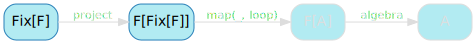
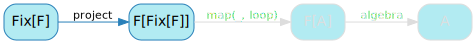
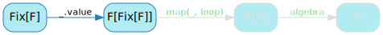
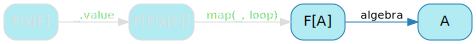

[English version (origin)](https://nrinaudo.github.io/recschemes/fix.html)

[Назад](./tree_height.md) | [Оглавление](./README.md) | [Дальше](./generative_recursion.md)

# Уменьшение шаблонного кода

Мы видели, что создание типа данных, "готового к катаморфизму", потребовало много усилий:
- написать тип данных
- реализовать паттерн функтор, который требует большого количества копирования / вставок кода
- написать проекцию в паттерн функтор, что требует большего количества копирования / вставок кода
- написать экземпляр `Functor`, который включает в себя еще больше копирования / вставок кода

И вы должны сделать все это, прежде чем сможете начать писать интересный код, то, что действительно решает вашу проблему, F-алгебру.

Самым неприятным моментом, вероятно, является необходимость дважды писать один и тот же тип, учитывая, насколько близки тип и его паттерн функтор. Интуиция, которой мы здесь будем следовать, состоит в том, что можно было бы написать одно в терминах другого, поскольку они очень похожи.


## `List` с точки зрения `ListF`

Мы видели, что `ListF` может быть использован для представления списка. `ListF[List]` может обозначать:
- `None`: пустой список
- `Some((head, tail))`: cons элемент

`ListF[List]` не решает нашу проблему - нам все еще нужно определить и `ListF`, и `List`, чего мы как раз хотим избежать.

Наша цель - написать тип, представляющий собой `ListF` _чего-либо_. Назовем этот тип `List2`, потому что это что-то вроде списка, а не `List`:

```scala
type List2 = ListF[???]
```

И если вы помните, этот параметр типа представляет собой хвост нашего списка - подумайте о `ListF[List]`. Конец списка - это список: это меньший список, к которому мы добавляем `head`, чтобы получить полный.

По логике, конец `List2` должен иметь тип `List2`:

```scala
type List2 = ListF[List2]
//        type List2 = ListF[List2]
//                           ^
// On line 2: error: illegal cyclic reference involving type List2
```

К сожалению, это не будет компилироваться, потому что Scala не поддерживает псевдонимы рекурсивных типов.

Но вся эта серия статей была посвящена рекурсивным типам данных, так что давайте их. Если `List2` не может *быть* `ListF[List2]`, тогда может быть он сможет *содержать* его:

```scala
case class List2(value: ListF[List2])
```

## Создаем `List2`

`List2` всегда немного сбивает меня с толку, у меня проблемы с пониманием того, что он представляет. Когда это происходит, мне нравится рисовать (плохо), чтобы визуализировать, так что давайте попробуем это и здесь.


Вот как мы объявим наши обычные `3 :: 2 :: 1 :: nil` как `List2`:

```scala
val ints2: List2 =
  List2(Some((3,
    List2(Some((2,
      List2(Some((1,
        List2(None)
      )))
    )))
  )))
```

А вот возможная визуализация этого, где сам `List2` представлен в виде ромба:


Вы все еще можете увидеть наш исходный список там:


`List2` - это просто структура, которая нам нужна, чтобы успокоить компилятор и заставить его принять определение рекурсивного типа. Вся структура списка находится в `ListF`: необязательные `head` и `tail`.

## Обобщаем `List2`

Это было интересное наблюдение: `List2` сам по себе не кодирует структуру списка, это делает `ListF`. Если бы мы использовали другой паттерн функтор - скажем, TreeF, то получили бы совершенно другой рекурсивный тип данных:

```scala
case class Tree2(value: TreeF[Tree2])
```

И да, это дерево: `Tree2` содержит `TreeF`, который является одним из:
- `LeafF`: пустое дерево
- `NodeF`: узел дерева, содержащий значение и ссылки на левый и правый `Tree2`

Древовиднее некуда.

Но `Tree2` и` List2` - это в основном одно и то же, верно? Разумеется, другие имена, и мы скоро это исправим, и другой паттерн функтор, но что мешает нам превратить этот паттерн функтор в параметр?

```scala
case class List2[F[_]](value: F[List2[F]])
```

Не позволяйте названию вводить вас в заблуждение, этот тип является обобщенной структурой данных, используемой для представления любого рекурсивного типа данных в терминах его паттерна функтор. Это не обязательно очевидно - я не сразу понимаю что значит `F[List2[F]]`, но если вставить конкретные типы:
- `List2[ListF]` просто рекурсивная структура вокруг `ListF`: то есть список
- `List2[TreeF]` просто рекурсивная структура вокруг `TreeF`: то есть дерево

## Именование

`List2` явно плохое название для чего-то, что предназначено для представления любого рекурсивного типа данных. Оказывается, эта структура хорошо известна и уже имеет официальное название: `Fix`, или комбинатор неподвижной точки.

```scala
case class Fix[F[_]](value: F[Fix[F]])
```

Происхождение этого странного имени на этот раз на удивление простое:
- неподвижная точка функции `f` это `x` такой, что `f(x) = x`.
- `fix` это функция, которая для данной функции возвращает ее неподвижную точку
- если `fix(f)` неподвижная точка `f`, тогда `fix(f) = f(fix(f))`
- это именно то определение, которое мы только что написали в виде кода на Scala 

## `List` с точки зрения `Fix`

Теперь, когда мы знаем, как выразить рекурсивный тип данных в терминах его паттерна функтор, давайте сделаем это правильно. Вот `FixedList`:

```scala
type FixedList = Fix[ListF]
```

Вы можете создавать значения этого типа, хотя это не очень приятно:

```scala
val fixedInts: FixedList =
  Fix[ListF](Some((3,
    Fix[ListF](Some((2,
      Fix[ListF](Some((1,
        Fix[ListF](None)
      )))
    )))
  )))
```

Хотя могло быть и хуже - мы могли бы создать дерево.

## `Tree` с точки зрения `TreeF`

Кстати о дьяволе, вот `FixedTree`, дерево, выраженное как` Fix` и `TreeF`:

```scala
type FixedTree = Fix[TreeF]
```

И, да, вы можете создавать значения, если вы достаточно себя ненавидите:

```scala
val fixedIntTree: FixedTree =
  Fix[TreeF](NodeF(
    Fix[TreeF](NodeF(
      Fix[TreeF](NodeF(Fix[TreeF](LeafF), 1, Fix[TreeF](LeafF))),
      2,
      Fix[TreeF](NodeF(Fix[TreeF](LeafF), 3, Fix[TreeF](LeafF)))
    )),
    4,
    Fix[TreeF](LeafF)
  ))
```

## `cata` вместе с `Fix`

Теперь, когда мы проделали всю эту работу, давайте посмотрим на некоторые конкретные преимущества. Давайте специализируем нашу реализацию катаморфизма на рекурсивных типах данных, выраженных в терминах `Fix`.

Начнем с `cata` и переименуем его:

```scala
def cataFix[F[_]: Functor, A, B](
  algebra: F[A] => A,
  project: B => F[B]
): B => A = {
  def loop(state: B): A =
    algebra(map(project(state), loop))
  loop
}
```

Первое, что мы сделаем, это изменим тип ввода, поскольку мы знаем, что это больше не `B`:


`cataFix` теперь работает для типов данных, выраженных как `Fix[F]`, что означает, что `B` везде становится `Fix[F]`:

```scala
def cataFix[F[_]: Functor, A](
  algebra: F[A] => A,
  project: Fix[F] => F[Fix[F]]
): Fix[F] => A = {
  def loop(state: Fix[F]): A =
    algebra(map(project(state), loop))
  loop
}
```

Не смотря на то, что он удаляет элементы из диаграммы, все становится немного мистическим:




## Проецируя `Fix`

Следующий шаг - спроецировать наш входной тип в его паттерн функтор:



Есть два способа сделать это.

Первый - это обычный волшебный трюк на языке функционального программирования со статической типизацией: _с учетом типов, которые у нас есть, есть только один способ написать это_. Это дало бы нам правильный ответ почти сразу, за счет того, что никто не понимает, почему это правильный ответ, кроме _моего воображаемого друга, компилятора_. Но мы не собираемся этого делать, потому что цель этой серии статей - чтобы у вас появилось понимание.

Второй способ немного более обходной, но он работает точно так же хорошо: мы начнем с первоначальной реализации `project` для `List` и затем проведем его рефакторинг. Начнем с переименования его в `projectFix`:

```scala
val projectFix: List => ListF[List] = {
  case Cons(head, tail) => Some((head, tail))
  case Nil              => None
}
```

Мы знаем, что хотим написать версию, специфичную для `FixedList`, которая на самом деле является просто `Fix[ListF]`:

```scala
val projectFix: Fix[ListF] => ListF[Fix[ListF]] = {
  case Fix(Some((head, tail))) => Some((head, tail))
  case Fix(None)               => None
}
```

Обратите внимание, как мы заменили `Cons` на `Fix(Some)` и `Nil` на `Fix(None)`.

Если вы посмотрите на полученное сопоставление с образцом, вы увидите, что в обоих случаях мы просто берем значение, которое находится внутри `Fix`, и возвращаем его.

Мы можем переписать все сопоставление с образцом, чтобы просто развернуть значение:

```scala
val projectFix: Fix[ListF] => ListF[Fix[ListF]] =
  _.value
```

И ничего из этого не является специфическим для ListF, что позволяет нам превратить его в параметр типа:

```scala
def projectFix[F[_]]: Fix[F] => F[Fix[F]] =
  _.value
```

`projectFix` просто разворачивает слой` Fix`.

Это позволяет нам переписать `cataFix`, чтобы функция проекции больше не требовалась, поскольку она всегда будет обращаться только к полю `value`:

```scala
def cataFix[F[_]: Functor, A](
  algebra: F[A] => A
): Fix[F] => A = {
  def loop(state: Fix[F]): A =
    algebra(map(state.value, loop))
  loop
}
```

Это дает нам следующую диаграмму:



## Экземпляр функтора

На этом этапе все становится намного проще. Нам нужно иметь возможность запускать `map` для нашего паттерна функтор.


Однако здесь не требуется дополнительной работы: наш паттерн функтор, по определению, уже имеет экземпляр `Functor`. Мы уже определили экземпляры функторов `ListF` и `TreeF`, нам не нужно делать это снова.

## F-Алгебра

Точно так же нам не нужно переопределять F-алгебры: они работают непосредственно с паттерном функтор, который у нас есть на данном этапе.



Мы можем повторно использовать все F-алгебры, которые мы определили ранее, без каких-либо дополнительных изменений.

## `product` с точки зрения `cataFix`

`productFix`, версию `product` которая работает с `FixedList`, определить проще, чем раньше, поскольку мы можем игнорировать проекцию:

```scala
val productFix: FixedList => Int =
  cataFix(productAlgebra)
```

И все равно дает ожидаемый результат:

```scala
productFix(fixedInts)
// res21: Int = 6
```

## `height` с точки зрения `cataFix`

То же самое касается `heightFix`, версии `height` которая работает с `FixedTree`:

```scala
val heightFix: FixedTree => Int =
  cataFix(heightAlgebra)
```

Применение его к нашему стандартному дереву дает тот же результат, что и раньше:

```scala
heightFix(fixedIntTree)
// res22: Int = 3
```

## Цена `Fix`

Кажется, все идет хорошо, но за это приходится платить.

Сопоставление с образцом - очень распространенное занятие, и оно внезапно стало менее приятным. Вот как мы это делаем сейчас:

```scala
def headOpt(list: FixedList): Option[Int] = list match {
  case Fix(Some((head, _))) => Some(head)
  case Fix(None)            => None
}
```

Сравните это с тем, как мы это делали бы до использования `Fix`:

```scala
def headOpt(list:      List): Option[Int] = list match {
  case Cons(     head, _)   => Some(head)
  case Nil                  => None
}
```

Это не радикальное изменение, но, безусловно, больше шаблонного кода и требование, чтобы вы знали и понимали более сложную структуру.

Люди могут возразить, что это несправедливо, что весь смысл катаморфизмов в том, что вам больше не нужно выполнять сопоставление с образцом. Я думаю, что это верно лишь отчасти, сопоставление с образцом по-прежнему является полезным инструментом, но давайте сделаем вид, что аргумент верен.

А как насчет создания значений? Конечно, мы ожидаем, что люди будут делать совсем немного - в конце концов, причина, по которой мы пишем типы данных, состоит в том, чтобы иметь возможность манипулировать значениями этих типов, и эти значения должны быть созданы в какой-то момент.

Вот что вам нужно сделать сейчас:

```scala
val list: FixedList =
  Fix[ListF](Some((3,
    Fix[ListF](Some((2,
      Fix[ListF](Some((1,
        Fix[ListF](None)
      )))
    )))
  )))
```

Вот как мы это сделали бы до использования `Fix`:

```scala
val list:      List =
  Cons(            3,
    Cons(            2,
      Cons(            1,
        Nil
      )
    )
  )
```

Это неоспоримо хуже - и мы ещё думали, что оригинальный способ создания значений был слишком многословным!

## Ключевые выводы

Мы увидели, что можем использовать `Fix` для упрощения некоторых вещей для авторов типов данных. Как автор типа данных, мне не нужно писать свой тип *и* реализовывать для него паттерн функтор, а также проекцию одного на другое. Использование `Fix` сделало мою жизнь лучше.

Хотя только один раз. Мне нужно было бы реализовать паттерн функтор и написать проекцию только один раз за все время существования моего типа данных.

С другой стороны, использование `Fix` делает вашу жизнь, как потребителя типа данных, менее приятной: сопоставление с образцом и создание значений стали более сложными. Это делает вашу жизнь хуже *каждый раз, когда вы хотите создать значение*.

Я считаю, что это совершенно неправильный компромисс. Я должен справляться со сложностью, чтобы вам не приходилось этого делать, а не навязывать ее вам, чтобы я мог ее игнорировать.

Вот мой (правда, язвительный) взгляд на `Fix`. Его использование:
- делает сложное проще (для меня, автора типа данных)
- делает простые вещи сложнее (для вас, потребителя типа данных)
- имеет мало смысла

К сожалению, практически каждый пост в блоге или статья, объясняющая схемы рекурсии, будет делать это с помощью `Fix`. Помимо того, что это не требование, это даже не лучшая идея!

[Назад](./tree_height.md) | [Оглавление](./README.md) | [Дальше](./generative_recursion.md)

This work is licensed under a <a rel="license" href="https://creativecommons.org/licenses/by/4.0/">Creative Commons Attribution 4.0 International License</a>.