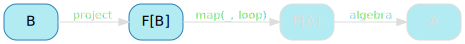

[English version (origin)](https://nrinaudo.github.io/recschemes/fix.html)

[Назад](./tree_height.md) | [Оглавление](./README.md) | [Дальше](./generative_recursion.md)

# Уменьшение шаблонного кода

We've seen that making a data type "catamorphism-ready" was a lot of busywork:
- write the data type.
- write its pattern functor, which involves a lot of copy / pasting.
- write its projection into that pattern functor, which involves more copy / pasting.
- write a `Functor` instance, which involves yet more copy / pasting.

And you must do all of these things before you can start writing the interesting code, the thing that actually solves your problem, the F-Algebra.

The most frustrating bit is probably having to basically write the same type twice, given how close a type and its pattern functor are. The intuition that we'll follow here is that it might be possible to write one in terms of the other, since they're so similar.


## `List` с точки зрения `ListF`

We've seen that `ListF` can be used to represent something that's kind of a list. `ListF[List]` can be:
- `None`: the empty list.
- `Some((head, tail))`: a cons cell.

`ListF[List]` doesn't solve our problem though - we still have to define both `ListF` and `List`, which is exactly what we want to avoid.

Our goal is to write a type that's a `ListF` of _something_. Let's call that type `List2`, because it's kind of a list, but not a `List`:

```scala
type List2 = ListF[???]
```

And if you remember, that type parameter represents the tail of our list - think of `ListF[List]`. The tail of a list is a list: it's the smaller list to which we prepend `head` to get a complete one.

Logically, the tail of a `List2` must be of type `List2`:

```scala
type List2 = ListF[List2]
//        type List2 = ListF[List2]
//                           ^
// On line 2: error: illegal cyclic reference involving type List2
```

This unfortunately won't compile, because Scala doesn't allow recursive type aliases.

But this entire series of articles has been about recursive data types, so let's try that instead. If `List2` can't *be* a `ListF[List2]`, then it can *contain* one:

```scala
case class List2(value: ListF[List2])
```

## Building a `List2`

`List2` always makes me a bit confused, I have troubles seeing what it represents. When that happens, I like to draw things (badly) to help me visualise them, so let's try that here.


Here's how we'd declare our usual `3 :: 2 :: 1 :: nil` as a `List2`:

```scala
val ints2: List2 =
  List2(Some((3,
    List2(Some((2,
      List2(Some((1,
        List2(None)
      )))
    )))
  )))
```

And here's a potential visualisation of it, where `List2` itself is represented as a diamond:


You can still view our original list in there:


`List2` is really just structure that we needed to appease the compiler and have him accept a recursive type definition. The entire structure of a list is in `ListF`: an optional `head` and `tail`.

## Generalising `List2`

This was an interesting observation: `List2` itself doesn't encode the structure of a list, `ListF` does. If we were to use another pattern functor - `TreeF`, say, we would get an entirely different recursive data type:

```scala
case class Tree2(value: TreeF[Tree2])
```

And, yes, that is a tree: a `Tree2` contains a `TreeF`, which is one of:
- `LeafF`: the empty tree.
- `NodeF`: a tree node, containing a value and references to left and right `Tree2`s.

It doesn't get more tree-ish than that.

But `Tree2` and `List2` are basically the same thing, right? Different names, certainly, and we'll fix that soon, and a different pattern functor, but what's to stop us from turning that pattern functor into a parameter?

```scala
case class List2[F[_]](value: F[List2[F]])
```

Don't let the name fool you, that type is a generic data structure used to represent any recursive data type in terms of its pattern functor. It's not necessary obvious - that `F[List2[F]]` does my head in whenever I look at it - but put in concrete types:
- `List2[ListF]` is just recursive structure around a `ListF`: a list.
- `List2[TreeF]` is just recursive structure around a `TreeF`: a tree.

## Naming things

`List2` is clearly a bad name for something that is meant to represent any recursive data type. It turns out that this structure is well known and already has an official name: `Fix`, or the fixed-point combinator.

```scala
case class Fix[F[_]](value: F[Fix[F]])
```

The origin of that peculiar name is surprisingly straightforward, for once:
- the fixed-point of function `f` is `x` such that `f(x) = x`.
- `fix` is the function that, given a function, returns its fixed-point.
- if `fix(f)` is the fixed-point of `f`, then `fix(f) = f(fix(f))`
- that is exactly the definition we just wrote as Scala code.

## `List` с точки зрения `Fix`

Now that we know how to express a recursive data type in terms of its pattern functor, let's do so properly. Here's `FixedList`:

```scala
type FixedList = Fix[ListF]
```

You can create values of that type, although it's not very pleasant:

```scala
val fixedInts: FixedList =
  Fix[ListF](Some((3,
    Fix[ListF](Some((2,
      Fix[ListF](Some((1,
        Fix[ListF](None)
      )))
    )))
  )))
```

It could be worse though - we could be creating a tree.

## `Tree` с точки зрения `TreeF`

Speaking of the devil, here's `FixedTree`, a tree expressed as a `Fix` and a `TreeF`:

```scala
type FixedTree = Fix[TreeF]
```

And, yes, you can create values, if you hate yourself enough:

```scala
val fixedIntTree: FixedTree =
  Fix[TreeF](NodeF(
    Fix[TreeF](NodeF(
      Fix[TreeF](NodeF(Fix[TreeF](LeafF), 1, Fix[TreeF](LeafF))),
      2,
      Fix[TreeF](NodeF(Fix[TreeF](LeafF), 3, Fix[TreeF](LeafF)))
    )),
    4,
    Fix[TreeF](LeafF)
  ))
```

## `cata` with `Fix`

Now that we've done all that work, let's see some concrete benefits. Let's specialise our catamorphism implementation to recursive data types expressed in terms of `Fix`.

We'll start from `cata` and rename it:

```scala
def cataFix[F[_]: Functor, A, B](
  algebra: F[A] => A,
  project: B => F[B]
): B => A = {
  def loop(state: B): A =
    algebra(map(project(state), loop))
  loop
}
```

The first thing we'll do is change the input type, since we know it's not a `B` anymore:



`cataFix` works specifically for data types expressed as `Fix[F]`, which means that `B` becomes `Fix[F]` everywhere:

```scala
def cataFix[F[_]: Functor, A](
  algebra: F[A] => A,
  project: Fix[F] => F[Fix[F]]
): Fix[F] => A = {
  def loop(state: Fix[F]): A =
    algebra(map(project(state), loop))
  loop
}
```

On the other hand, while it does remove elements from the diagram, things get a little bit mystical there:


## Проецируя `Fix`

Следующий шаг - спроецировать наш входной тип в его паттерн функтор:


Есть два способа сделать это.

Первый - это обычный волшебный трюк на языке функционального программирования со статической типизацией: _с учетом типов, которые у нас есть, есть только один способ написать это_. Это дало бы нам правильный ответ почти сразу, за счет того, что никто не понимает, почему это правильный ответ, кроме _моего воображаемого друга, компилятора_. Но мы не собираемся этого делать, потому что цель этой серии статей - именно для того, чтобы у вас появилось понимание.

Второй способ немного более обходной, но он работает точно так же хорошо: мы начнем с первоначальной реализации `project` для `List` и затем проведем его рефакторинг. Начнем с переименования его в `projectFix`:

```scala
val projectFix: List => ListF[List] = {
  case Cons(head, tail) => Some((head, tail))
  case Nil              => None
}
```

We know we want to write a version specific to `FixedList`, which is really just `Fix[ListF]`:

```scala
val projectFix: Fix[ListF] => ListF[Fix[ListF]] = {
  case Fix(Some((head, tail))) => Some((head, tail))
  case Fix(None)               => None
}
```

Note how we replaced `Cons` by `Fix(Some)` and `Nil` by `Fix(None)`.

If you take a look at the resulting pattern match, you'll see that in both cases, we're simply taking the value that's inside of the `Fix` and returning it.

We can rewrite the entire pattern match to just unwrap the value:

```scala
val projectFix: Fix[ListF] => ListF[Fix[ListF]] =
  _.value
```

And none of this code is specific to `ListF`, which allows us to turn it into a type parameter:

```scala
def projectFix[F[_]]: Fix[F] => F[Fix[F]] =
  _.value
```

`projectFix` is simply unwrapping a layer of `Fix`.

This allows us to rewrite `cataFix` to not need a projection function anymore, since it'll always just be accessing the `value` field:

```scala
def cataFix[F[_]: Functor, A](
  algebra: F[A] => A
): Fix[F] => A = {
  def loop(state: Fix[F]): A =
    algebra(map(state.value, loop))
  loop
}
```

Это дает нам следующую диаграмму:


## Экземпляр функтора

На этом этапе все становится намного проще. Нам нужно иметь возможность запускать `map` для нашего паттерна функтор.


Однако здесь не требуется дополнительной работы: наш паттерн функтор, по определению, уже имеет экземпляр `Functor`. Мы уже определили экземпляры функторов `ListF` и `TreeF`, нам не нужно делать это снова.

## F-Алгебра

Точно так же нам не нужно переопределять F-алгебры: они работают непосредственно с паттерном функтор, который у нас есть на данном этапе.


Мы можем повторно использовать все F-алгебры, которые мы определили ранее, без каких-либо дополнительных изменений.

## `product` с точки зрения `cataFix`

`productFix`, версию `product` которая работает с `FixedList`, определить проще, чем раньше, поскольку мы можем игнорировать проекцию:

```scala
val productFix: FixedList => Int =
  cataFix(productAlgebra)
```

И все равно дает ожидаемый результат:

```scala
productFix(fixedInts)
// res21: Int = 6
```

## `height` с точки зрения `cataFix`

То же самое касается `heightFix`, версии `height` которая работает с `FixedTree`:

```scala
val heightFix: FixedTree => Int =
  cataFix(heightAlgebra)
```

Применение его к нашему стандартному дереву дает тот же результат, что и раньше:

```scala
heightFix(fixedIntTree)
// res22: Int = 3
```

## Цена `Fix`

Кажется, все идет хорошо, но за это приходится платить.

Сопоставление с образцом - очень распространенное занятие, и оно внезапно стало менее приятным. Вот как мы это делаем сейчас:

```scala
def headOpt(list: FixedList): Option[Int] = list match {
  case Fix(Some((head, _))) => Some(head)
  case Fix(None)            => None
}
```

Сравните это с тем, как мы это делали бы до использования `Fix`:

```scala
def headOpt(list:      List): Option[Int] = list match {
  case Cons(     head, _)   => Some(head)
  case Nil                  => None
}
```

Это не радикальное изменение, но, безусловно, больше шаблонного кода и требование, чтобы вы знали и понимали более сложную структуру.

Люди могут возразить, что это несправедливо, что весь смысл катаморфизмов в том, что вам больше не нужно выполнять сопоставление с образцом. Я думаю, что это верно лишь отчасти, сопоставление с образцом по-прежнему является полезным инструментом, но давайте сделаем вид, что аргумент верен.

А как насчет создания значений? Конечно, мы ожидаем, что люди будут делать совсем немного - в конце концов, причина, по которой мы пишем типы данных, состоит в том, чтобы иметь возможность манипулировать значениями этих типов, и эти значения должны быть созданы в какой-то момент.

Вот что вам нужно сделать сейчас:

```scala
val list: FixedList =
  Fix[ListF](Some((3,
    Fix[ListF](Some((2,
      Fix[ListF](Some((1,
        Fix[ListF](None)
      )))
    )))
  )))
```

Вот как мы это сделали бы до использования `Fix`:

```scala
val list:      List =
  Cons(            3,
    Cons(            2,
      Cons(            1,
        Nil
      )
    )
  )
```

Это неоспоримо хуже - и мы ещё думали, что оригинальный способ создания значений был слишком многословным!

## Ключевые выводы

Мы увидели, что можем использовать `Fix` для упрощения некоторых вещей для авторов типов данных. Как автор типа данных, мне не нужно писать свой тип *и* реализовывать для него паттерн функтор, а также проекцию одного на другое. Использование `Fix` сделало мою жизнь лучше.

Хотя только один раз. Мне нужно было бы реализовать паттерн функтор и написать проекцию только один раз за все время существования моего типа данных.

С другой стороны, использование `Fix` делает вашу жизнь, как потребителя типа данных, менее приятной: сопоставление с образцом и создание значений стали более сложными. Это делает вашу жизнь хуже *каждый раз, когда вы хотите создать значение*.

Я считаю, что это совершенно неправильный компромисс. Я должен справляться со сложностью, чтобы вам не приходилось этого делать, а не навязывать ее вам, чтобы я мог ее игнорировать.

Вот мой (правда, язвительный) взгляд на `Fix`. Его использование:
- делает сложное проще (для меня, автора типа данных)
- делает простые вещи сложнее (для вас, потребителя типа данных)
- имеет мало смысла

К сожалению, практически каждый пост в блоге или статья, объясняющая схемы рекурсии, будет делать это с помощью `Fix`. Помимо того, что это не требование, это даже не лучшая идея!

[Назад](./tree_height.md) | [Оглавление](./README.md) | [Дальше](./generative_recursion.md)

This work is licensed under a <a rel="license" href="https://creativecommons.org/licenses/by/4.0/">Creative Commons Attribution 4.0 International License</a>.