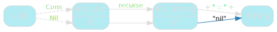
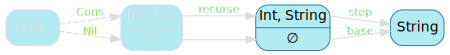

[English version (origin)](https://nrinaudo.github.io/recschemes/fold.html)

[Назад](./structural_recursion.md) | [Оглавление](./index.md) | [Дальше](./cata.md)

# Обобщённая структурная рекурсия

Мы видели, что структурная рекурсия включает несколько общих компонентов. Наша цель на данный момент состоит в том, чтобы абстрагироваться от этих компонентов и предоставить общую функцию структурной рекурсии.

## Обобщение `mkString`

Мы начнем с `mkString`, и будем его менять, шаг за шагом, пока не добьемся желаемого результата:

```scala
def mkString(
  values: List
): String =
  values match {
    case Cons(head, tail) => head + " :: " + mkString(tail)
    case Nil              => "nil"
  }
```

Нашим первым шагом будет переименование `mkString`. Назовем его `recurse` - это довольно плохое имя, но сейчас не самое подходящее время, чтобы пытаться найти хорошее: мы еще не знаем, что у нас получится и как оно будет использоваться. Я считаю полезным не слишком беспокоиться об именах до тех пор, пока не пойму лучше, что именно я пытаюсь назвать.

```scala
def recurse(
  values: List
): String =
  values match {
    case Cons(head, tail) => head + " :: " + recurse(tail)
    case Nil              => "nil"
  }
```

`recurse` можно представить с помощью следующей диаграммы:


Мы начинаем из `List`, следуя структуре превращаем их в голову и хвост (`Cons`) или ничего (`Nil`), применяем `recurse` к хвосту, затем какая-то захардкоженая магия, чтобы получить окончательный результат.

Захардкоженая магия - это то от чего мы хотим избавиться.


## Обобщаем базовый вариант

Самое простое решение - найти решение минимальной задачи, известной как базовый вариант. В настоящее время это жестко запрограммировано на `"nil"`:



Вместо использования жестко запрограммированной строки давайте вынесем её в константу:

```scala
val base = "nil"
```

И теперь мы можем переделать`recurse` с использованием `base` как параметра:

```scala
def recurse(
  base  : String,
  values: List
): String =
  values match {
    case Cons(head, tail) => head + " :: " + recurse(base, tail)
    case Nil              => base
  }
```

Это улучшение; по крайней мере, часть жестко закодированной магии ушла:


## Обобщаем шаг

Но у нас еще немного осталось:


Берётся `head`, результат от `tail`, и возвращается решение нашей задачи. Это можно представить как простую функцию, традиционно известную как `step`:

```scala
def step(head: Int, tailResult: String) =
  head + " :: " + tailResult
```

Как и раньше, теперь, когда у нас есть `step` реализованный для `mkString`, мы можем убрать хардкод из `recurse` и передать его как параметр:

```scala
def recurse(
  base  : String,
  step  : (Int, String) => String,
  values: List
): String =
  values match {
    case Cons(head, tail) => step(head, recurse(base, step, tail))
    case Nil              => base
  }
```

И теперь, похоже, мы избавились от всех жестко запрограммированных значений:


## Обобщаем возвращаемый тип

Однако есть еще немного хардкода, но не на уровне значений: возвращаемый тип `recurse`.



Сейчас это `String`, но мы знаем, что нам нужно больше, чем это: `product` возвращает `Int`, например.

К счастью, это легко обобщить: мы никогда не использовали тот факт, что этот возвращаемый тип `String` - просто чтобы `base` и `step`  использовали тот же тип. Это позволяет нам превратить его в параметр типа:

```scala
def recurse[A](
  base  : A,
  step  : (Int, A) => A,
  values: List
): A =
  values match {
    case Cons(head, tail) => step(head, recurse(base, step, tail))
    case Nil              => base
  }
```

И теперь мы избавились от всего, что было характерно для `mkString`:


## Упрощаем шаг

Мы можем немного подправить код, прежде чем идти дальше. Каким бы кратким он ни был, мне немного неприятно читать слово `recurse`.

В частности, мне не нравится рекурсивный вызов `recurse` и тот факт, что он принимает так много параметров. Это затрудняет понимание того, что происходит, где я действительно хотел бы, чтобы можно было просто сказать _получить результат от `хвоста`_ без лишнего шума.

В таких обстоятельствах мне нравится создавать внутренние вспомогательные функции. Здесь мы можем взять всю ветку выражения и извлечь ее в помощник, который традиционно называется `loop` или `go`:

```scala
def recurse[A](
  base  : A,
  step  : (Int, A) => A,
  values: List
): A = {
  def loop(state: List): A =
    state match {
      case Cons(head, tail) => step(head, loop(tail))
      case Nil              => base
    }

  loop(values)
}
```

Признаться, это больше кода, чем у нас было, но компоненты структурной рекурсии теперь более четко видны в `loop`. Мы можем видеть:
- наименьшую возможную задачу (`Nil`), и ее решение `base`.
- остальные (`Cons`), состоящие из меньших задач (`tail`) и дополнительных данных (`head`).
  - меньшую задачу, для которой мы предполагаем, что у нас есть решение (вызывая `loop`).
  - решение более крупной задачи получается путем объединения с помощью `step`.

Это дает нам обновленную диаграмму для `recurse`:


## Отбрасываем параметры

Наконец, мы можем видеть, что параметр `values` из` recurse` просто передается в `loop` - который на самом деле просто прокси.

Давайте сделаем его более конкретным, `recurse` будет возвращать `loop` (частично примененную функцию) вместо `loop(values)` (результата выполнения функции):

```scala
def recurse[A](
  base: A,
  step: (Int, A) => A
): List => A = {
  def loop(state: List): A =
    state match {
      case Cons(head, tail) => step(head, loop(tail))
      case Nil              => base
    }

  loop
}
```

Кто-то может возразить, что это небольшое улучшение - единственное реальное изменение для вызывающих состоит в том, что у `recurse` теперь есть два списка параметров, которые хоть и не ужасны, но, безусловно, менее просты, чем один.

Но это *улучшение*, если учесть наиболее распространенный вариант использования: объявление комбинаторов, которые полагаются на `recurse`. Возьмем уже знакомый `mkString`:

```scala
def mkString(ints: List): String =
  recurse(base, step)(ints)
```

Мы можем легко преобразовать его в:

```scala
val mkString: List => String =
  recurse(base, step)
```

Что я бы сказал более ясно: `mkString` это просто конкретное приложение `recurse`.


## Именование

Теперь, когда мы почти закончили с `recurse` и лучше понимаем, что он делает, пришло время дать ему правильное название для функционального программирования.

Возможно, вы уже сталкивались с этим, это очень распространенный комбинатор: `fold`.

Название немного поэтично: оно описывает, как вы складываете лист на себя, чтобы получить результат.

```scala
def fold[A](
  base: A,
  step: (Int, A) => A
): List => A = {
  def loop(state: List): A =
    state match {
      case Cons(head, tail) => step(head, loop(tail))
      case Nil              => base
    }

  loop
}
```

## Умножение как свёртка

Мы проделали всю эту работу по обобщению `mkString`, чтобы иметь возможность использовать его для написания других комбинаторов, и было бы стыдно закончить этот раздел, не показав, что` product` может быть легко записан как конкретный `fold` :

```scala
val product: List => Int =
  fold[Int](
    base = 1,
    step = (head, tailProduct) => head * tailProduct
  )
```

## Ключевые выводы

Мы видели, что обобщение структурной рекурсии было относительно простой задачей: просто сделать все ключевые компоненты параметрами, и все вроде как работает.

Что ж. При условии, что вы не против жестко привязать свою реализацию к структуре определенного типа. Наш `fold` работает только для списков. Мы должны попытаться что-то с этим сделать.

[Назад](./structural_recursion.md) | [Оглавление](./index.md) | [Дальше](./cata.md)

This work is licensed under a <a rel="license" href="https://creativecommons.org/licenses/by/4.0/">Creative Commons Attribution 4.0 International License</a>.