[English version (origin)](https://nrinaudo.github.io/recschemes/hylo.html)

[Назад](./ana.md) | [Оглавление](./README.md) | [Дальше](./conclusion.md)

# Обобщённая свёртка и развёртка

Мы видели, что обобщенные свёртки (`cata`) и обобщенные развёртки (`ana`) казались пугающе похожими.

В этой последней части серии мы исследуем это сходство.

## `cata` и `ana`

Если вы посмотрите на `cata` и `ana` как на диаграммы, довольно сложно сказать, что есть что:

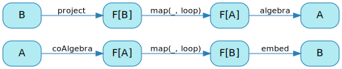

Мы знаем что `cata` использует алгебру, а `ana` коалгебру, таким образом верхняя часть диаграммы это `cata`, а нижняя - `ana`. Но они действительно очень похожи.

На самом деле они похожи по двум причинам.

## Двойственность `cata` и `ana`

Первая причина более заметна, если вы как бы перевернете диаграмму для `ana` - не меняя ее значения, а только расположение узлов:

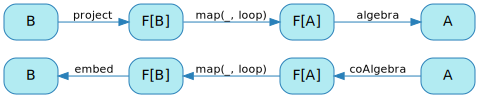

И если вы посмотрите на это в таком свете, вы увидите, что `ana` - это просто `cata`, но с "перевернутыми" стрелками: те же узлы, но стрелки, идут в противоположном направлении.

Это то, что люди имеют в виду, когда они говорят, что `cata` и `ana` являются двойственными друг с другом: они противоположны друг другу. Интуитивно это имеет смысл: вы используете `cata` для сворачивания рекурсивного типа данных в одно значение, а `ana` разворачивает одно значение в рекурсивный тип данных.

Это первое сходство `cata` и `ana` - они противоположны друг другу.

## Композирование `cata` и `ana`

Но если `cata` и `ana` являются двойственными друг другу, это означает, что одно начинается там, где заканчивается другое, не так ли? Это означает, что мы можем композировать их, например, применив `cata` к результату `ana`:

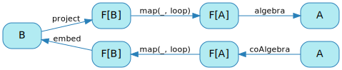

Например, мы можем композировать `range` и `product`.

`range` возвращает числа от 1 до заданного числа, а `product` перемножает их: это `факториал` - крайне неэффективная его реализация, но тем не менее `факториал`:

```scala
val factorial: Int => Int =
  range andThen product

factorial(3)
// res40: Int = 6
```


Аналогичным образом, композиция `range` и `mkString` является строковым представлением диапазона:

```scala
val showRange: Int => String =
  range andThen mkString

showRange(3)
// res41: String = 3 :: 2 :: 1 :: nil
```

## Упрощение `ana andThen cata`

Давайте посмотрим на `showRange` более подробно. Вот соответствующая диаграмма, на которой указаны все конкретные типы и функции:

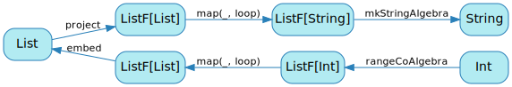

Если вы посмотрите на крайнюю левую часть этой диаграммы, вы увидите, что там есть несколько ненужных сегментов: мы переходим от `ListF[List]` к `List` и обратно к `ListF[List]`.

Давайте посмотрим, работает ли эта интуиция, посмотрев на фактические значения. Мы собираемся подробно описать шаги `showRange(3)`. Согласно нашей диаграмме, мы начнем с `rangeCoAlgebra`:

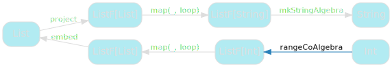

Вот код этой функции:

```scala
val rangeCoAlgebra: Int => ListF[Int] = i => {
  if(i > 0) Some((i, i - 1))
  else      None
}
```

Если вы выполните его, то в конечном итоге получите вложенные `Some`, которые представляют список `3 :: 2 :: 1`:


```scala
Some((3, Some((2, Some((1, None)))))) // rangeCoAlgebra
```

Согласно нашей диаграмме, после некоторой магии рекурсии с помощью `map`, нам нужно применить `embed`:

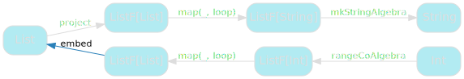

Вот код для `embed`, который говорит нам сопоставить `Some` с `Cons`, `None` с `Nil` и оставить `head` в покое:

```scala
val embed: ListF[List] => List = {
  case Some((head, tail)) => Cons(head, tail)
  case None               => Nil
}
```

Применяя это к нашему предыдущему вложенному `Some` получаем:

```scala
Some((3, Some((2, Some((1, None)))))) // rangeCoAlgebra
Cons( 3, Cons( 2, Cons( 1, Nil )))    // embed
```

Следующим шагом будет `project`:

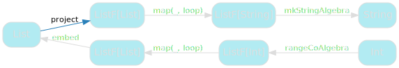

По сути, это отменяет то, что сделал `embed`: он отображает `Cons` в `Some`, `Nil` в `None` и оставляет `head` в покое:


```scala
val project: List => ListF[List] = {
  case Cons(head, tail) => Some((head, tail))
  case Nil              => None
}
```

Неудивительно, что это дает значение, которое мы имели до применения `embed`.

```scala
Some((3, Some((2, Some((1, None))))))  // rangeCoAlgebra
Cons( 3, Cons( 2, Cons( 1, Nil )))     // embed
Some((3, Some((2, Some((1, None))))))  // project
```

Наконец, после прохождения еще одной рекурсивной магии map, нам нужно применить `mkStringAlgebra`:

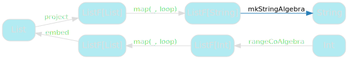

Это говорит нам сопоставить `Some` с `step`, `None` с `base` и оставить `head` в покое:

```scala
val mkStringAlgebra: ListF[String] => String = {
  case Some((head, tailResult)) => step(head, tailResult)
  case None                     => base
}
```

Это наше последнее состояние перед фактическим получением результата `showRange`:

```scala
Some((3, Some((2, Some((1, None)))))) // rangeCoAlgebra
Cons( 3, Cons( 2, Cons( 1, Nil )))    // embed
Some((3, Some((2, Some((1, None)))))) // project
step( 3, step( 2, step( 1, base)))    // mkStringAlgebra
```

И действительно кажется, что шаги 2 (`embed`) и 3 (`project`) можно пропустить - они просто возвращаются к результату `rangeCoAlgebra`.

Вот шаги, которые мы хотели бы сделать вместо этого:

```scala
Some((3, Some((2, Some((1, None)))))) // rangeCoAlgebra
step( 3, step( 2, step( 1, base)))    // mkStringAlgebra
```

Которые можно изобразить следующей диаграммой:

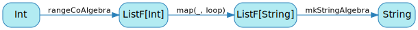

Давайте сделаем эту диаграмму обобщенной - заменим конкретные типы на параметры:

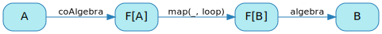

Вам простительно предположить, что я допустил ошибку и скопировал диаграмму для `ana`, но они немного отличаются:

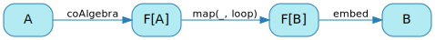

Вы видите разницу? Это просто название последней стрелки. У нашей желаемой функции есть `algebra`, где у `ana` есть `embed`.

Однако это просто имя параметра, мы можем провести рефакторинг `ana`, чтобы взять `algebra`, не меняя его поведения:

```scala
def ana[F[_]: Functor, A, B](
  coAlgebra: A => F[A],
  algebra  : F[B] => B
): A => B = {

  def loop(state: A): B =
    algebra(map(coAlgebra(state), loop))

  loop
}
```

И это действительно работает: если вы напишете `showRange` как анаморфизм, вы получите ожидаемый результат:

```scala
def showRange: Int => String =
  ana(rangeCoAlgebra, mkStringAlgebra)

showRange(3)
// res42: String = 3 :: 2 :: 1 :: nil
```

## Именование

Несмотря на то, что это просто `ana` с совершенно бессмысленной разницей, у этого есть причудливое название: _hylomorphism_, или для краткости _hylo_:

```scala
def hylo[F[_]: Functor, A, B](
  coAlgebra: A => F[A],
  algebra  : F[B] => B
): A => B = {

  def loop(state: A): B =
    algebra(map(coAlgebra(state), loop))

  loop
}
```

Кажется странным считать, что `hylo` и `ana` - разные вещи, хотя их код одинаковый, не так ли?

Что ж...

## Волшебный трюк

Для моего следующего трюка мы собираемся провести чисто косметический рефакторинг `hylo`.

Во-первых, поменяйте местами `A` и `B` - это на самом деле ничего не меняет, это просто произвольные имена.

```scala
def hylo[F[_]: Functor, A, B](
  coAlgebra: B => F[B],
  algebra  : F[A] => A
): B => A = {

  def loop(state: B): A =
    algebra(map(coAlgebra(state), loop))

  loop
}
```

Затем мы изменим порядок объявления `algebra` и `coAlgebra`:

```scala
def hylo[F[_]: Functor, A, B](
  algebra  : F[A] => A,
  coAlgebra: B => F[B]
): B => A = {

  def loop(state: B): A =
    algebra(map(coAlgebra(state), loop))

  loop
}
```

Наконец, мы переименуем `coAlgebra` в `project`.

```scala
def hylo[F[_]: Functor, A, B](
  algebra: F[A] => A,
  project: B => F[B]
): B => A = {

  def loop(state: B): A =
    algebra(map(project(state), loop))

  loop
}
```

И теперь, когда мы это сделали, я хотел бы, чтобы вы рассказали мне о различиях между `hylo` и `cata`. [Вот](./cata.md#Именование-вещей) реализация `cata`, к которой мы пришли, если вам нужно освежить память.

Удивительно, правда? `hylo` и `cata` - *тоже* одно и то же.

Это вторая причина схожести `cata` и `ana`: это *одно и то же*.

## Ключевые выводы

Мы увидели, что `cata` и `ana` похожи по двум причинам:
* они двойственны друг другу - они делают противоположные вещи
* в то же время они одно и то же

Да, это немного вызывает головную боль. Но есть разумное объяснение! Проблема здесь в том, что наши типы недостаточно точны.

Мы определили `cata` как структурную рекурсию для типов, которые могут быть спроецированы в паттерн функтор. И это правда, что проекция - это своего рода коалгебра - в конце концов, они обе имеют один и тот же тип: `A => F[A]`. Но не все коалгебры являются проекциями: например, `rangeCoAlgebra` не проецирует рекурсивный тип данных в свой паттерн функтор.

Точно так же вложения(`embed`) являются алгебрами, но не все алгебры являются вложениями(`embed`).

Вот ключевое различие между `ana`, `cata` и `hylo`:
* `cata` - это специализированный вид `hylo`, используемый для свертывания рекурсивного типа данных на себя
* `ana` - это специализированный вид `hylo`, используемый для преобразования значения в рекурсивный тип данных
* `hylo` - это обе эти вещи, возможно, обобщенные дальше, чем это строго разумно

[Назад](./ana.md) | [Оглавление](./README.md) | [Дальше](./conclusion.md)

This work is licensed under a <a rel="license" href="https://creativecommons.org/licenses/by/4.0/">Creative Commons Attribution 4.0 International License</a>.