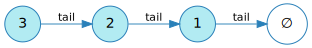
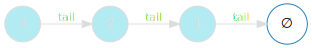
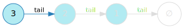

[English version (origin)](https://nrinaudo.github.io/recschemes/recursive_data_types.html)

[Назад](./introduction.md) | [Оглавление](./index.md) | [Дальше](./structural_recursion.md)

# Рекурсивные типы данных

Прежде чем мы сможем говорить о схемах рекурсии, нам нужно начать с самого начала. Самый первый шаг - понять, что такое рекурсивные типы данных.

Вы, наверное, уже знаете о рекурсивных функциях - функциях, которые вызывают сами себя. Рекурсивные типы данных такие же: типы, которые содержат сами себя.

Самый простой, который я могу придумать, - это скромный связанный список, который правильные функциональные программисты называют _cons_, потому что почему бы и нет.



Самый простой список из возможных - пустой, который мы называем `Nil`:




Непустой список - это `Cons`, который состоит из:

- первое значение в списке, которое мы называем `head`
- ссылка на остальную часть списка, которую мы называем `tail`



`tail` является рекурсивной частью: непустой список содержит меньший список, который может быть пустым или непустым.

Этот список можно легко закодировать в Scala - мы сделаем его мономорфным, чтобы все было еще проще:

```scala
sealed trait List

case class Cons(
  head: Int,
  tail: List
) extends List

case object Nil extends List
```

И вот как вы создаете значения этого типа:

```scala
val ints: List =
  Cons(3, Cons(2, Cons(1, Nil)))
```

Это не здорово - нужно немного прищуриться, чтобы увидеть, где находятся ваши данные. Создание значения всегда немного обременительно при работе с рекурсивными типами данных, но для этого есть решения, которые мы обсудим немного позже.

Теперь, когда мы знаем, что такое рекурсивные типы данных, наш следующий шаг - заняться с ними чем-нибудь интересным.

[Назад](./introduction.md) | [Оглавление](./index.md) | [Дальше](./structural_recursion.md)

This work is licensed under a <a rel="license" href="https://creativecommons.org/licenses/by/4.0/">Creative Commons Attribution 4.0 International License</a>.