[English version (origin)](https://nrinaudo.github.io/recschemes/tree_height.html)

[Назад](./cata.md) | [Оглавление](./README.md) | [Дальше](./fix.md)

# Это можно применить к другим типам?

Мы видели, что структурная рекурсия может быть обобщена на катаморфизмы, и что они теоретически способны работать с любым типом, который можно спроецировать в паттерн функтор.

Однако пока мы видели только `List`. Мы собираемся взглянуть на другой рекурсивный тип данных, имея в виду две цели:
- дать вам некоторую уверенность в том, что катаморфизмы работают не только для `List`
- продемонстрировать, как взять существующий тип и сделать его "готовым к катаморфизму"

## Бинарное дерево

Сделав самый простой рекурсивный тип данных, который я мог придумать, мономорфный список, мы рассмотрим второй простейший: мономорфное бинарное дерево.

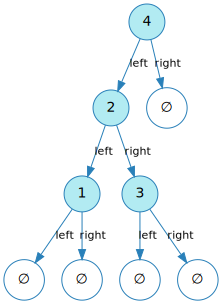

Самое простое возможное дерево - это пустое дерево, которое мы называем `leaf`:

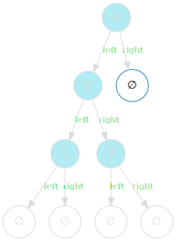


Непустое дерево называется `node`, и состоит из:
- значения `value`
- ветки `left`, ссылки на левое поддерево
- ветки `right`, ссылки на правое поддерево

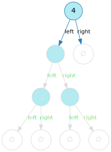

Мы можем закодировать это почти напрямую в код Scala:

```scala
sealed trait Tree

case class Node(
  left : Tree,
  value: Int,
  right: Tree
) extends Tree

case object Leaf extends Tree
```

Однако, как и `List`, создание значений немного обременительно - повторяющаяся проблема с рекурсивными типами данных:

```scala
val intTree =
  Node(
    Node(
      Node(Leaf, 1, Leaf),
      2,
      Node(Leaf, 3, Leaf)
    ),
    4,
    Leaf
  )
```

## Высота дерева

Задача, которую мы собираемся решить, - это высота дерева, которая определяется как:

> Высота дерева - это длина самого длинного пути между его корнем и нелистовым узлом.

Графически мы видим, что наше дерево из примера имеет высоту 3:

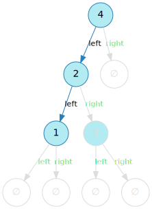

Наша цель - вычислить это с помощью катаморфизма. Для этого мы сделаем прямо противоположное тому, что делали раньше: уйдем от общего определения катаморфизма и сделаем все конкретным.

Наш первый шаг - определить типы параметров:

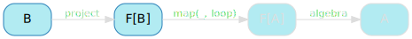

Это просто: мы знаем, что тип параметра функции, которая вычисляет высоту дерева, должен быть `Tree`.

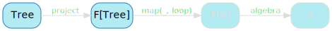

## Паттерн функтор

Когда у нас есть тип входных параметров, пора применить к нему паттерн функтор:

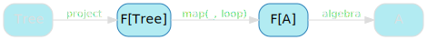

Мы могли бы использовать тот же трюк, который мы сделали, почти случайно, для `List`, и использовать необязательную левую ветвь, правую ветвь и значение, но я бы предпочел этого избежать. Кортежи меня быстро сбивают с толку, везде скобки, запутанные имена полей ...

Вместо этого мы будем использовать очень механический подход, который можно применить к любому рекурсивному типу данных, с которым вы столкнетесь.

Первый шаг - взять ваш тип и его ветви и добавить к их именам букву F:

```scala
sealed trait TreeF

case class NodeF(
  left : Tree,
  value: Int,
  right: Tree
) extends TreeF

case object LeafF extends TreeF
```

Второй шаг - добавить параметр типа. Помните, что параметр типа в паттерне функтор используется для представления рекурсивной части вашего типа данных, и именно так мы можем сопоставить его с типом задачи до и после ее решения. Это означает, что мы должны заменить любое `Tree` в `TreeF` и его подтипах нашим параметром типа:

```scala
sealed trait TreeF[+A]

case class NodeF[A](
  left : A,
  value: Int,
  right: A
) extends TreeF[A]

case object LeafF extends TreeF[Nothing]
```

Не волнуйтесь, если вы не понимаете `+A` и `Nothing` - их совершенно безопасно рассматривать как синтаксический трюк, позволяющий объявить `LeafF` как объект.

И это наш паттерн функтор! В случае, например, высоты дерева, мы знаем, что будем манипулировать двумя типами TreeF:
- `TreeF[Tree]`, представляет собой явное разделение больших задач на более мелкие
- `TreeF[A]`, представление более крупных задач и решение более мелких, составляющих их


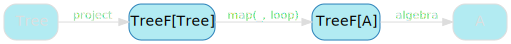

## Проекция

Имея наш входной тип `Tree` и его функтор `TreeF`, мы должны иметь возможность проецировать один на другой:

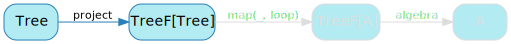

Это прямое отображение `Node` в `NodeF` и `Leaf` в `LeafF`:

```scala
def projectTree: Tree => TreeF[Tree] = {
  case Node(l, v, r) => NodeF(l, v, r)
  case Leaf          => LeafF
}
```

Это дает нам следующую обновленную диаграмму:

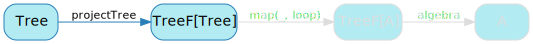

## Экземпляр функтора

Конечно, `TreeF`, будучи паттерном функтор, должен иметь экземпляр функтор - в противном случае мы не можем вызвать `map`.

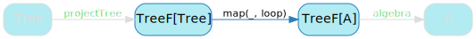

Мы можем предоставить этот экземпляр, применив ту же логику, которую мы использовали для `ListF`: применить функцию преобразования к каждой рекурсивной части дерева.

```scala
implicit val treeFFunctor = new Functor[TreeF] {
  override def map[A, B](tree: TreeF[A], f: A => B) =
    tree match {
      case NodeF(left, i, right) => NodeF(f(left), i, f(right))
      case LeafF                 => LeafF
    }
}
```

Это настолько механическая реализация, что, скорее всего, ее можно получить автоматически.(Я успешно сделал это для `TreeF` используя [kittens](https://github.com/typelevel/kittens) но не могу гарантировать, что это всегда возможно - просто я не встречал случая, когда это не возможно).


## F-Алгебра

Наконец, мы подошли к одной части, которая действительно интересна: F-алгебре. Часть, в которой мы фактически вычисляем высоту нашего дерева.

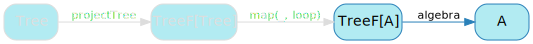

Базовый случай очевиден: высота пустого дерева равна 0.

Шаг также относительно интуитивно понятен: нам дается высота левого и правого поддеревьев. Наибольшее из этих значений - это самый длинный путь от прямого потомка текущего узла до нелистового узла, и добавление к нему единицы дает высоту дерева.


```scala
val heightAlgebra: TreeF[Int] => Int = {
  case NodeF(left, _, right) => 1 + math.max(left, right)
  case LeafF                 => 0
}
```

Это дает нам последнюю недостающую часть нашей проблемы:

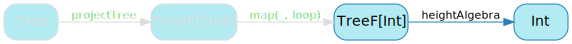


## Высота дерева

Теперь мы можем объявить комбинатор `height`, объединив все эти вещи в катаморфизм:

```scala
val height: Tree => Int =
  cata(heightAlgebra, projectTree)
```

И это, к счастью, дает ожидаемый результат:

```scala
height(intTree)
// res20: Int = 3
```

## Ключевые выводы

Кажется, что катаморфизмы работают не только для мономорфного списка, но и для большего количества типов. Но ... это определенно требует много работы, не так ли?

Далее мы рассмотрим, к сожалению, популярный метод решения этой проблемы.

[Назад](./cata.md) | [Оглавление](./README.md) | [Дальше](./fix.md)

This work is licensed under a <a rel="license" href="https://creativecommons.org/licenses/by/4.0/">Creative Commons Attribution 4.0 International License</a>.