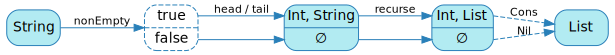
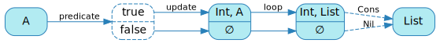

[English version (origin)](https://nrinaudo.github.io/recschemes/unfold.html)

[Назад](./generative_recursion.md) | [Оглавление](./README.md) | [Дальше](./ana.md)

# Обобщённая генеративная рекурсия

Now that we understand what generative recursion is, we're going to generalise an existing generative recursion function so that it can be used to express all others.

## Generalising `charCodes`

We're going to start from `charCodes`, whose code is:

```scala
def charCodes(
  from: String
): List = {
  if(from.nonEmpty)
    Cons(from.head.toInt, charCodes(from.tail))
  else Nil
}
```

As before, our first step is going to be to rename it. Let's call it `recurse` because why not.

```scala
def recurse(
  from: String
): List = {
  if(from.nonEmpty)
    Cons(from.head.toInt, recurse(from.tail))
  else Nil
}
```

Here's a diagram that represents how `charCodes` behaves:



We first check whether the input string is empty. If it's not, we extract its head (as an int) and tail, then recurse on the later to get the tail of our new list.

Finally, we create a new list from that optional head and tail.


## Generalising the predicate

Our first step is going to be to generalise that `nonEmpty` predicate:


As we did before for `fold`, this is relatively straightforward. We'll start by creating a `predicate` function that does the same thing:

```scala
def predicate(from: String): Boolean =
  from.nonEmpty
```

After which we can update `recurse` to take `predicate` as a parameter, and use that instead of the hard-coded `nonEmpty`.

```scala
def recurse(
  predicate: String => Boolean,
  from     : String
): List = {
  if(predicate(from))
    Cons(from.head.toInt, recurse(predicate, from.tail))
  else Nil
}
```

This is already a significant improvement: we have removed some hard-coded magic.


## Generalising the update

The next step is to take care of the hard-coded bit that turns a string into its head and tail.


We can do so by extracting the logic into a function that takes a `String` and splits it into a tuple:

```scala
def update(from: String): (Int, String) =
  (from.head.toInt, from.tail)
```

This forces us to rewrite `recurse` a little bit to take `update` as a parameter, but the logic is still the same:

```scala
def recurse(
  predicate: String => Boolean,
  update   : String => (Int, String),
  from     : String
): List = {
  if(predicate(from)) {
    val (head, nextState) = update(from)
    Cons(head, recurse(predicate, update, nextState))
  }
  else Nil
}
```

And we've now gotten rid of all the hard-coded value-level bits:


## Generalising the input type

We're still limited to taking strings as input, though.


Luckily, this can easily be worked around: we never actually use the fact that our state is a string. Our only requirement is that it's the same type that's manipulated by `predicate` and `update`, which we can express through a type parameter:

```scala
def recurse[A](
  predicate: A => Boolean,
  update   : A => (Int, A),
  from     : A
): List = {
  if(predicate(from)) {
    val (head, nextState) = update(from)
    Cons(head, recurse(predicate, update, nextState))
  }
  else Nil
}
```

We now have a new `recurse` function that abstracts over its input type, predicate and update functions.


## Simplifying the step

We're almost done, but for the same readability reasons as with `fold`, I want to turn the body of `recurse` into an internal helper function:

```scala
def recurse[A](
  predicate: A => Boolean,
  update   : A => (Int, A),
  from     : A
): List = {

  def loop(state: A): List =
    if(predicate(state)) {
      val (head, nextState) = update(state)
      Cons(head, loop(nextState))
    }
    else Nil

  loop(from)
}
```

This yields the final diagram for our `recurse` function:



## Dropping parameters

The observation we made while writing `fold` that it was just passing its parameters directly to `loop` still holds, so we'll do the same thing we did then: have `recurse` return `loop` directly.

```scala
def recurse[A](
  predicate: A => Boolean,
  update   : A => (Int, A)
): A => List = {

  def loop(state: A): List =
    if(predicate(state)) {
      val (head, nextState) = update(state)
      Cons(head, loop(nextState))
    }
    else Nil

  loop
}
```

And this is a pretty decent implementation of generative recursion, stack safety issues aside.

## Именование вещей

Before we can move on, we must of course do the functional programmer thing and give it a proper name.

This is commonly known as `unfold`, which I find sort of poetic: where we used `fold` to sort of collapse a list onto itself and turn it into a single value, `unfold` does the opposite by unfolding a single value into a list.

```scala
def unfold[A](
  predicate: A => Boolean,
  update   : A => (Int, A)
): A => List = {

  def loop(state: A): List =
    if(predicate(state)) {
      val (head, nextState) = update(state)
      Cons(head, loop(nextState))
    }
    else Nil

  loop
}
```

And our `unfold` still does exactly the same thing `charCodes` did:

```scala
mkString(unfold(predicate, update)("cata"))
// res31: String = 99 :: 97 :: 116 :: 97 :: nil
```

## `range` as an unfold

We know have an `unfold` implementation that should allow us to write recursive generation functions more comfortably. We know `charCodes` works - this is what we've been doing all along, but what about `range`?

```scala
val range: Int => List =
  unfold[Int](
    predicate = state => state > 0,
    update    = state => (state, state - 1)
  )
```

We apply exactly the same logic as in our first implementation, but without having to do the boilerplate work:
- predicate: is our state greater than 0?
- update: use the state as the new `head`, and decrement the old state by 1 to get the new one.

This, of course, behaves exactly as before:

```scala
mkString(range(3))
// res32: String = 3 :: 2 :: 1 :: nil
```

## Ключевые выводы

We've seen that generative recursion was straightforward to generalise: turn its predicate and update function into parameters.

This allows us to have a general generative recursion function, `unfold`. General, that is, provided you're working with `List` as output...

[Назад](./generative_recursion.md) | [Оглавление](./README.md) | [Дальше](./ana.md)

This work is licensed under a <a rel="license" href="https://creativecommons.org/licenses/by/4.0/">Creative Commons Attribution 4.0 International License</a>.