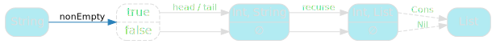
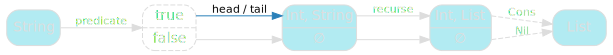
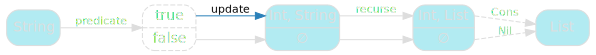
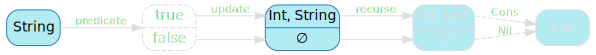

[English version (origin)](https://nrinaudo.github.io/recschemes/unfold.html)

[Назад](./generative_recursion.md) | [Оглавление](./README.md) | [Дальше](./ana.md)

# Обобщённая генеративная рекурсия

Теперь, когда мы понимаем, что такое генеративная рекурсия, мы собираемся обобщить существующую функцию генеративной рекурсии, чтобы ее можно было использовать для выражения всех остальных.

## Обобщаем `charCodes`

Начнем с `charCodes`, вот его код:

```scala
def charCodes(
  from: String
): List = {
  if(from.nonEmpty)
    Cons(from.head.toInt, charCodes(from.tail))
  else Nil
}
```

Как и раньше, нашим первым шагом будет его переименование. Назовем это `recurse`, потому что почему бы и нет.

```scala
def recurse(
  from: String
): List = {
  if(from.nonEmpty)
    Cons(from.head.toInt, recurse(from.tail))
  else Nil
}
```

Вот диаграмма, которая показывает, как ведет себя `charCodes`:


Сначала мы проверяем, пуста ли входная строка. Если это не так, мы извлекаем её голову (как int) и хвост, а затем рекурсивно выполняем последующие операции, чтобы получить хвост нашего нового списка.

Наконец, мы создаем новый список из этой опциональной головы и хвоста.


## Обобщаем предикат

Нашим первым шагом будет обобщение предиката `nonEmpty`:



Как и раньше для `fold`, это относительно просто. Мы начнем с создания функции `predicate`, которая делает то же самое:

```scala
def predicate(from: String): Boolean =
  from.nonEmpty
```

После чего мы можем обновить `recurse`, чтобы он принимал `predicate` в качестве параметра и использовать его вместо жестко запрограммированного `nonEmpty`.

```scala
def recurse(
  predicate: String => Boolean,
  from     : String
): List = {
  if(predicate(from))
    Cons(from.head.toInt, recurse(predicate, from.tail))
  else Nil
}
```

Это уже значительное улучшение: мы удалили некоторую жестко закодированную магию.


## Обобщаем update

Следующий шаг - позаботиться о жестко запрограммированной магии, которая превращает строку в ее голову и хвост.



Мы можем сделать это, выделив логику в функцию, которая принимает строку и разбивает ее на кортеж:

```scala
def update(from: String): (Int, String) =
  (from.head.toInt, from.tail)
```

Это вынуждает нас немного переписать `recurse`, чтобы использовать `update` в качестве параметра, но логика остается той же:

```scala
def recurse(
  predicate: String => Boolean,
  update   : String => (Int, String),
  from     : String
): List = {
  if(predicate(from)) {
    val (head, nextState) = update(from)
    Cons(head, recurse(predicate, update, nextState))
  }
  else Nil
}
```

И теперь мы избавились от всей жестко закодированной магии уровня значений:



## Обобщаем входной тип

Однако мы по-прежнему принимаем на вход только строки.



К счастью, это легко обойти: мы никогда не используем тот факт, что наше состояние является строкой. Наше единственное требование - это тот же тип, которым манипулируют `predicate` и `update`, что мы можем выразить через параметр типа:

```scala
def recurse[A](
  predicate: A => Boolean,
  update   : A => (Int, A),
  from     : A
): List = {
  if(predicate(from)) {
    val (head, nextState) = update(from)
    Cons(head, recurse(predicate, update, nextState))
  }
  else Nil
}
```

Теперь у нас есть новая функция `recurse`, которая абстрагируется от своего входного типа, функций предиката и обновления.


## Упрощаем шаг

Мы почти закончили, но по тем же причинам удобочитаемости, что и в случае с `fold`, я хочу превратить тело `recurse` во внутреннюю вспомогательную функцию:

```scala
def recurse[A](
  predicate: A => Boolean,
  update   : A => (Int, A),
  from     : A
): List = {

  def loop(state: A): List =
    if(predicate(state)) {
      val (head, nextState) = update(state)
      Cons(head, loop(nextState))
    }
    else Nil

  loop(from)
}
```

Это дает окончательную диаграмму для нашей рекурсивной функции:


## Отбрасываем параметры

Наблюдение, сделанное нами при написании `fold` о том, что он просто передает свои параметры напрямую в `loop`, все еще сохраняется, поэтому мы сделаем то же самое, что и тогда: сделаем так, чтобы `recurse` возвращал `loop` напрямую.

```scala
def recurse[A](
  predicate: A => Boolean,
  update   : A => (Int, A)
): A => List = {

  def loop(state: A): List =
    if(predicate(state)) {
      val (head, nextState) = update(state)
      Cons(head, loop(nextState))
    }
    else Nil

  loop
}
```

И это довольно приличная реализация генеративной рекурсии, если оставить проблемы безопасности стека за скобками.

## Именование

Прежде чем мы сможем двигаться дальше, мы, конечно, должны заняться тем, что делают функциональные программисты и дать новому методу собственное имя.

Это широко известно как `развёртка` (`unfold`), что я считаю довольно поэтичным: там, где мы использовали `свёртку` (`fold`), чтобы свернуть список и превратить его в одно значение, `развёртка` (`unfold`) делает противоположное, разворачивая одно значение в список.

```scala
def unfold[A](
  predicate: A => Boolean,
  update   : A => (Int, A)
): A => List = {

  def loop(state: A): List =
    if(predicate(state)) {
      val (head, nextState) = update(state)
      Cons(head, loop(nextState))
    }
    else Nil

  loop
}
```

И наш `unfold` по-прежнему делает то же самое, что и `charCodes`:

```scala
mkString(unfold(predicate, update)("cata"))
// res31: String = 99 :: 97 :: 116 :: 97 :: nil
```

## `range` как `unfold`

Мы знаем, что есть реализация `unfold`, которая должна позволить нам писать рекурсивные функции генерации более комфортно. Мы знаем, что для `charCodes` это работает, но как насчет `range`?

```scala
val range: Int => List =
  unfold[Int](
    predicate = state => state > 0,
    update    = state => (state, state - 1)
  )
```

Мы применяем ту же логику, что и в нашей первой реализации, но без выполнения стандартной работы:
- предикат: наше состояние больше 0?
- функция обновления: использовать состояние в качестве новой `головы` и уменьшить старое состояние на 1, чтобы получить новое

Это, конечно, ведет себя точно так же, как и раньше:

```scala
mkString(range(3))
// res32: String = 3 :: 2 :: 1 :: nil
```

## Ключевые выводы

Мы видели, что генеративную рекурсию легко обобщить: превратить ее предикат и функцию обновления в параметры.

Это позволяет нам иметь общую функцию генеративной рекурсии, `unfold`. Общую, то есть при условии, что вы работаете с `List` в качестве результата ...

[Назад](./generative_recursion.md) | [Оглавление](./README.md) | [Дальше](./ana.md)

This work is licensed under a <a rel="license" href="https://creativecommons.org/licenses/by/4.0/">Creative Commons Attribution 4.0 International License</a>.